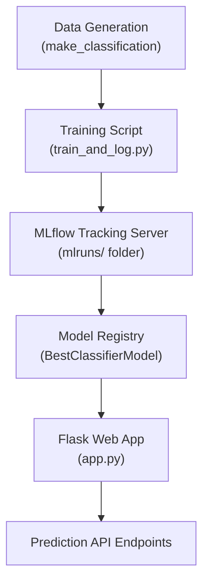
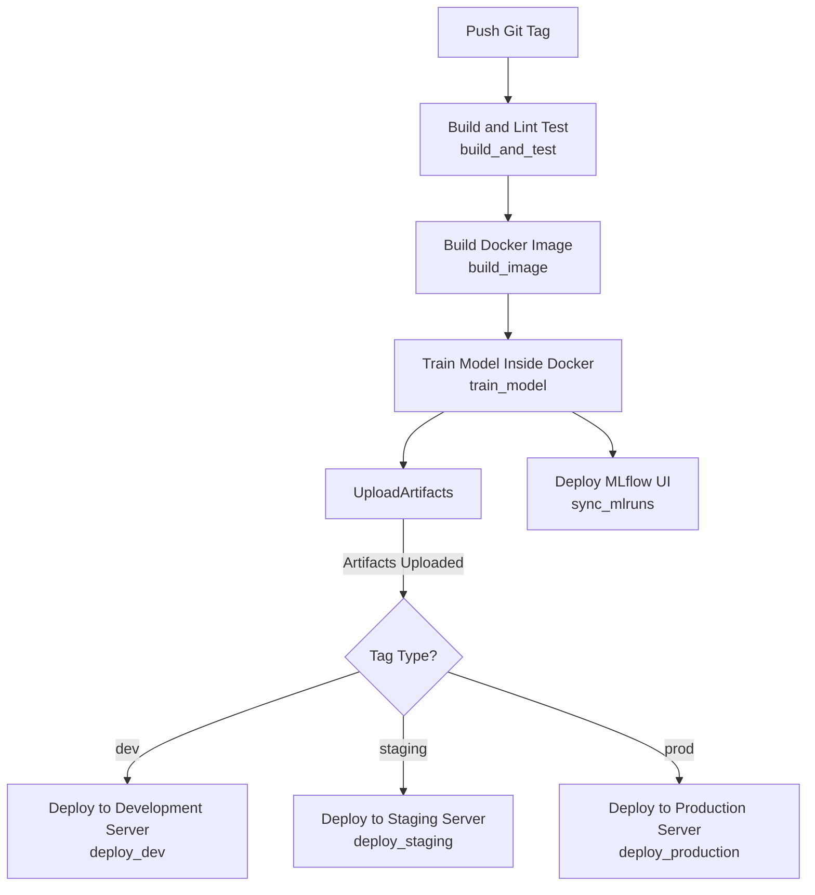

# MLflow Project - Classification Model Training and Web API Deployment

[](https://github.com/luandnh/ltek_learn_mlops/actions/workflows/deploy.yaml)

## Project Overview

This project demonstrates a complete machine learning workflow using **MLflow** and **Flask**. It focuses on a binary classification problem based on synthetic data generated with `make_classification` from **scikit-learn**.  
The main objectives include training multiple models, tuning their hyperparameters, comparing their performances, and deploying the best-performing model via a simple web application.

---

## System Architecture



---

## 🛠️ Mermaid CI/CD Workflow Diagram



---

### Explanation

- **Start**: Tag push triggers the pipeline.
- **build_and_test**: Install, lint, basic validation.
- **build_image**: Build and push Docker image.
- **train_model**: Run training inside the container.
- **upload_artifacts**: Save model results (`model_comparison_results`, `mlruns`).
- **deploy_mlflow_ui**: Sync mlruns into the MLflow UI project (for dev tags).
- Then:
  - If the tag contains `dev`, deploy to **development server**.
  - If it contains `staging`, deploy to **staging server**.
  - If it contains `prod`, deploy to **production server**.

---

## Sequence Flow

1. **Generate Dataset**  
   Synthetic dataset is created using `make_classification` with 20 features and 2 classes.

2. **Train Models**  
   `train_and_log.py` performs a manual grid search over models like Logistic Regression, Random Forest, and XGBoost based on the environment (Dev, Staging, Production).

3. **Log Experiments**  
   Each training run logs parameters, metrics, and models into the **local MLflow tracking server** (`mlruns/` folder).

4. **Register Best Model**  
   After all trials, the model with the highest accuracy is registered under `BestClassifierModel` in the **MLflow Model Registry**.

5. **Deploy Flask Web App**  
   The Flask application (`app.py`) loads the latest version of `BestClassifierModel` at startup and exposes REST endpoints for health check, information, listing all models, and prediction.

6. **Serve API**  
   The web service receives incoming prediction requests, applies the loaded model, and returns the prediction result.

7. **(Optional) CI/CD Deployment**  
   Upon pushing a new GitHub tag, the GitHub Actions workflow automatically builds, trains, saves models, and deploys the web API to Dev, Staging, or Production servers.

---

## Project Structure

```bash
├── app.py                          # Flask API serving the best model
├── train_and_log.py                # Training script to run experiments and log results
├── test_best_model.py              # Test script to validate model loading and prediction
├── Dockerfile                      # Dockerfile for building and running the project
├── requirements.txt                # Python dependencies
├── scripts/
│   └── sync_mlruns_artifact.sh     # Script to sync mlruns artifact
├── .github/workflows/
│   └── deploy.yaml                 # GitHub Actions workflow for CI/CD
│   └── commit.yaml                 # GitHub Actions workflow for CI/CD
├── mlruns/                         # MLflow tracking server (generated after training)
├── model_comparison_results.json   # Model evaluation results (generated after training)
├── model_comparison_results.csv    # CSV format of evaluation results (generated after training)
└── README.md                       # Project documentation (this file)
```

---

## Setup Instructions

### 1. Install Requirements

```bash
pip install -r requirements.txt
```

### 2. Train and Log Models

Run the training script to generate models, evaluations, and register the best model:

```bash
python train_and_log.py
```

Artifacts such as `mlruns/`, `model_comparison_results.json`, and `model_comparison_results.csv` will be generated after training.

### 3. Serve API Locally

Run the Flask web application to expose the model API:

```bash
python app.py
```

The API will be available at `http://localhost:8000`.

You can access the OpenAPI/Swagger documentation at `/` (root URL).

### 4. Build and Run with Docker

Build the Docker image:

```bash
docker build -t mlflow-flask-allinone .
```

Run the container:

```bash
docker run -p 8000:8000 mlflow-flask-allinone
```

### 5. CI/CD Workflow

The project includes a GitHub Actions workflow that automatically:

- Builds and tests the code
- Trains models inside Docker
- Uploads artifacts (trained models, logs)
- Deploys the Flask API to different environments based on tag naming conventions

### 6. Testing

Verify that the best model loads correctly and can make predictions by running:

```bash
python test_best_model.py
```

---

## API Overview

- `GET /health`  
  Returns the health status of the application and whether the model is loaded.

- `GET /info`  
  Provides basic information about the API version.

- `GET /api/models`  
  Lists all trained models with their hyperparameters and accuracies.

- `POST /api/predict`  
  Accepts a list of features and returns the predicted class.

Example input for `/api/predict`:

```json
{
  "features": [0.1, -1.2, 0.5, ..., 0.9]
}
```

Example response:

```json
{
  "prediction": 1
}
```

### API Documentation (OpenAPI + Scalar)

- **OpenAPI Specification** is available at:

  ```bash
  /openapi.json
  ```

- **Interactive Scalar UI** is automatically available at the root URL:

  ```bash
  /
  ```

  Scalar dynamically renders the OpenAPI spec into a modern, interactive API reference without requiring extra setup.

---

## Requirements

- Python 3.10
- Docker (for containerization)
- GitHub Actions (for automated deployment)

---

## License

This project is licensed for educational and experimental purposes.
